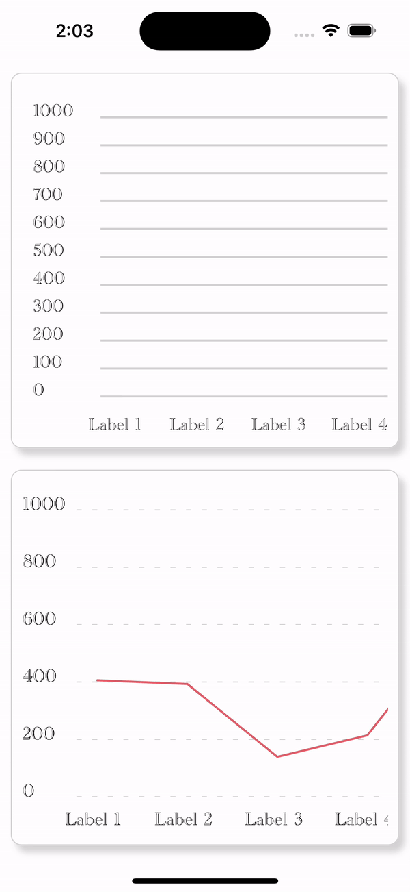
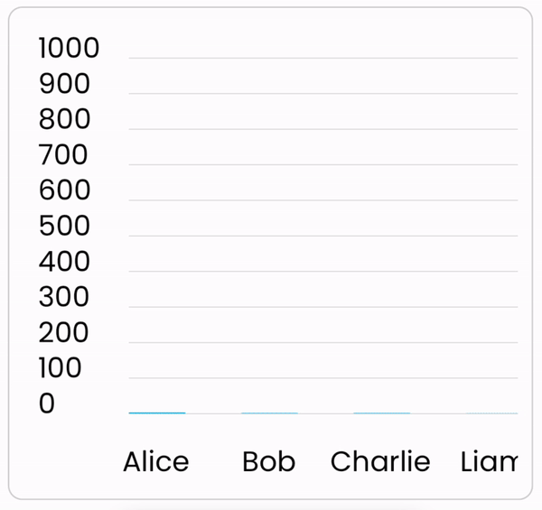

# react-native-graph-kit

[](https://www.android.com) [](https://developer.apple.com/ios) [](https://opensource.org/licenses/MIT)

---

Welcome to **React Native Graph Kit**, a powerful library that seamlessly integrates D3.js and @shopify/react-native-skia to provide LineChart and BarChart components with interactive tooltips for your React Native applications. With React Native Graph Kit, you can effortlessly visualize your data in a clean and intuitive manner, making it easier than ever for users to understand complex datasets.

- It also provides an example app and a detailed usage overview of both the components.
- Both the available components are fully Android and iOS compatible.

---

## 🎬 Preview



## Quick Access

[Installation](#installation) | [Charts](#charts) | [Properties](#properties) | [Example](#example) | [License](#license)

# Installation

##### 1. Install library and @shopify/react-native-skia

```bash
npm install react-native-graph-kit @shopify/react-native-skia
```

###### --- or ---

```bash
yarn add react-native-graph-kit @shopify/react-native-skia
```

##### 2. Install cocoapods in the ios project

```bash
cd ios && pod install
```

And you are good to begin.

---

# Charts

| LineChart                                                       | BarChart                                                       |
| --------------------------------------------------------------- | -------------------------------------------------------------- |
|  |  |

- LineChart: Create elegant line charts to showcase trends and patterns in your data.
- BarChart: Display data using visually appealing bar charts, making comparisons at a glance.

### ChartDataType

```jsx
type ChartDataType = {
  xAxis: {
    labels: string[]
  },
  yAxis: {
    datasets: number[]
  }
};
```

### ChartDataFormat

```jsx
const data = {
  xAxis: {
    labels: [
      'Alice',
      'Bob',
      'Charlie',
      'Liam',
      'Mia',
      'Nora',
      'Oliver',
      'Penelope',
      'Quinn',
      'Ryan',
      'Sophia'
    ]
  },
  yAxis: {
    datasets: [230, 75, 100, 500, 387, 655, 30, 60, 400, 500, 687]
  }
};
```

#### Usage

##### Basic Example

```jsx
import React from 'react';
import { SafeAreaView, StyleSheet, View } from 'react-native';
import { BarChart, LineChart } from 'react-native-graph-kit';

const data = {
  xAxis: {
    labels: [
      'Alice',
      'Bob',
      'Charlie',
      'Liam',
      'Mia',
      'Nora',
      'Oliver',
      'Penelope',
      'Quinn',
      'Ryan',
      'Sophia'
    ]
  },
  yAxis: {
    datasets: [120, 350, 400, 70, 87, 655, 10, 20, 400, 70, 87]
  }
};

const App = () => (
  <SafeAreaView style={styles.screen}>
    <View style={styles.chartContainer}>
      <BarChart
        chartData={data}
        barWidth={30}
        xAxisLength={70}
        horizontalGridLineColor={'grey'}
        chartHeight={300}
        yAxisMax={1000}
      />
    </View>
    <View style={styles.chartContainer}>
      <LineChart yAxisMax={1000} chartData={data} xAxisLength={70} initialDistance={30} />
    </View>
  </SafeAreaView>
);

const styles = StyleSheet.create({
  screen: {
    flex: 1
  },
  chartContainer: {
    flex: 1,
    borderRadius: 10,
    borderWidth: 0.5,
    borderColor: 'lightgrey',
    padding: 10,
    margin: 10,
    shadowColor: 'lightgrey',
    shadowOpacity: 1,
    backgroundColor: 'white',
    shadowOffset: {
      height: 6,
      width: 5
    }
  }
});

export default App;
```

---

# Properties

### Chart Props

| Prop                    | Default     | Type                                  | Description                                          | BarChart | LineChart |
| :---------------------- | :---------- | :------------------------------------ | :--------------------------------------------------- | -------- | --------- |
| **chartData\***         | null        | BarChartDataType or LineChartDataType | Data to plot graphs                                  | ✔️       | ✔️        |
| chartHeight             | 500         | number                                | Hight of chart in BarChart                           | ✔️       | ⤫         |
| showLines               | true        | boolean                               | Control visibility of Y Axis Ref lines on the chart  | ✔️       | ✔️        |
| lineHeight              | 2           | number                                | Height of horizontal grid lines in BarChart          | ✔️       | ⤫         |
| lineWidth               | 3           | number                                | The linewidth of LineChart                           | ⤫        | ✔️        |
| lineColor               | #DE5E69     | ColorValue                            | The line color of LineChart                          | ⤫        | ✔️        |
| barWidth                | 20          | number                                | The width of the bars in BarChart                    | ✔️       | ⤫         |
| barColor                | #DE5E69     | ColorValue                            | The color of the bars in BarChart                    | ✔️       | ⤫         |
| barRadius               | 0           | number                                | The borderRadius of the bars in BarChart             | ✔️       | ⤫         |
| labelSize               | 18          | number                                | The fontsize of labels on the chart                  | ✔️       | ✔️        |
| labelColor              | #000000     | ColorValue                            | The font color of chart labels                       | ✔️       | ✔️        |
| labelFontFamily         | System Font | ColorValue                            | The font path that will be applied to chart labels   | ✔️       | ✔️        |
| horizontalGridLineColor | #D3D3D3     | Color                                 | The Ref lines color                                  | ✔️       | ✔️        |
| yAxisMin                | 0           | number                                | The minimum value for the YAxis Plotting             | ✔️       | ✔️        |
| yAxisMax                | auto        | number                                | The minimum value for the YAxis Plotting             | ✔️       | ✔️        |
| initialDistance         | 10          | number                                | The initial distance of chart from the Y Axis Labels | ✔️       | ✔️        |
| xAxisLength             | auto        | number                                | Manual distance between x Axis Plotting              | ✔️       | ✔️        |
| verticalLabel           | false       | boolean                               | Handle rotation of X-Axis Labels                     | ✔️       | ✔️        |
| verticalLabelHeight     | auto        | number                                | Desired height of the X-Axis                         | ⤫        | ✔️        |
| chartBackgroundColor    | #FFFFFF     | Color                                 | Chart background color                               | ✔️       | ✔️        |
| legendSize              | 14          | number                                | Font size of X & Y Axis Legends                      | ✔️       | ✔️        |
| xAxisLegend             | undefined   | string                                | The X Axis Legend Value                              | ✔️       | ✔️        |
| yAxisLegend             | undefined   | string                                | The Y Axis Legend Value                              | ✔️       | ✔️        |
| xLegendMarginTop        | undefined   | number                                | Top Margin of Chart from X Axis Legend               | ✔️       | ✔️        |
| xLegendMarginBottom     | 5           | number                                | Bottom Margin of Chart X Axis Legend                 | ✔️       | ✔️        |
| yLegendMarginRight      | undefined   | number                                | Margin Right of Y Axis Legend                        | ✔️       | ✔️        |
| yLegendMarginLeft       | undefined   | number                                | Margin Left of Y Axis Legend                         | ✔️       | ✔️        |
| xLegendColor            | #949494     | ColorValue                            | X Axis Legend color                                  | ✔️       | ✔️        |
| yLegendColor            | #949494     | ColorValue                            | Y Axis Legend color                                  | ✔️       | ✔️        |

---

### ToolTip Props

| Prop                     | Default | Type    | Description                             | BarChart | LineChart |
| :----------------------- | :------ | :------ | :-------------------------------------- | -------- | --------- |
| displayToolTip           | false   | boolean | Flag to handle tooltip visibility       | ✔️       | ✔️        |
| toolTipLabelFontSize     | 12      | number  | Font size                               | ✔️       | ✔️        |
| toolTipColor             | #FF0000 | string  | Tooltip color                           | ✔️       | ✔️        |
| toolTipDataColor         | #FFFFFF | string  | Tooltip data color                      | ✔️       | ✔️        |
| toolTipHorizontalPadding | 20      | number  | Tooltip padding                         | ✔️       | ✔️        |
| toolTipFadeOutDuration   | 4000    | number  | Duration is ms to fade out tooltip      | ✔️       | ✔️        |
| circularPointerColor     | #000000 | string  | Color of circular pointer for LineChart | ⤫        | ✔️        |

---

# Example

A full working example project is here [Example](./example/src/App.tsx)

```sh
yarn
yarn example ios   // For ios
yarn example android   // For Android
```

# TODO

- [ ] Add Curve path prop in LineChart Component
- [ ] Landscape support

## Find this library useful? ❤️

Support it by joining [stargazers](https://github.com/SimformSolutionsPvtLtd/react-native-graph-kit/stargazers) for this repository.⭐

## Bugs / Feature requests / Feedbacks

For bugs, feature requests, and discussion please use [GitHub Issues](https://github.com/SimformSolutionsPvtLtd/react-native-graph-kit/issues/new?labels=bug&late=BUG_REPORT.md&title=%5BBUG%5D%3A), [GitHub New Feature](https://github.com/SimformSolutionsPvtLtd/react-native-graph-kit/issues/new?labels=enhancement&late=FEATURE_REQUEST.md&title=%5BFEATURE%5D%3A), [GitHub Feedback](https://github.com/SimformSolutionsPvtLtd/react-native-graph-kit/issues/new?labels=enhancement&late=FEATURE_REQUEST.md&title=%5BFEEDBACK%5D%3A)

## 🤝 How to Contribute

We'd love to have you improve this library or fix a problem 💪
Check out our [Contributing Guide](CONTRIBUTING.md) for ideas on contributing.

## Awesome Mobile Libraries

- Check out our other [available awesome mobile libraries](https://github.com/SimformSolutionsPvtLtd/Awesome-Mobile-Libraries)

## License

- [MIT License](./LICENSE)
